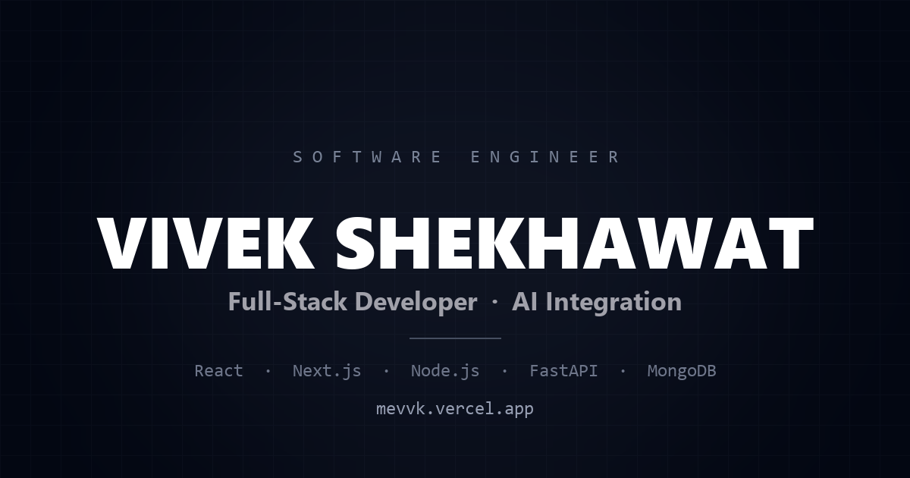

# Portfolio with AI Chatbot

A personal portfolio with a retrieval-grounded AI assistant that answers questions about my
background. Visitors can ask it anything — "What has he worked on?", "Does he know PostgreSQL?" —
and it responds from my actual resume rather than making things up.

**[Live site →](https://mevvk.vercel.app/)**

---

## What it does

- **Single-page portfolio** — hero, about, projects, experience, education, skills, contact
- **AI assistant** grounded in my resume, so answers stay factual and on-topic
- **Scroll-spy navigation** — the active section highlights in both the navbar and the section heading
- **Shared-element animation** — the hero portrait flies up and docks into the navbar as you scroll
- **Scroll-linked parallax** on the project list, with `prefers-reduced-motion` respected throughout

## Architecture

```
┌─────────────────┐      POST /chat      ┌──────────────────┐
│  React + Vite   │ ───────────────────► │  FastAPI         │
│  (Vercel)       │ ◄─────────────────── │  (Render)        │
└─────────────────┘   { response: ... }  └────────┬─────────┘
                                                  │
                                   ┌──────────────┴──────────────┐
                                   ▼                             ▼
                         ┌──────────────────┐         ┌────────────────────┐
                         │  OpenRouter      │         │  MongoDB Atlas     │
                         │  (Gemini Flash)  │         │  (chat history)    │
                         └──────────────────┘         └────────────────────┘
```

The resume is pre-extracted from PDF to `backend/extracted_resume.txt` and baked into the system
prompt at startup. At ~50 lines it fits comfortably in context, so there's no vector database or
embedding step — that would be complexity without benefit at this size.

MongoDB is **best-effort**: if it's unreachable, the chat still works and the write is skipped.
The API also boots without it rather than crashing, so a bad connection string can't take the
site down.

## Tech stack

| Layer | Stack |
|---|---|
| Frontend | React 19, TypeScript, Vite 7, Tailwind CSS v4, Framer Motion, Lenis |
| Backend | FastAPI, Pydantic v2, httpx, SlowAPI |
| Data | MongoDB Atlas (Motor async driver) |
| Model | Google Gemini 2.0 Flash Lite, via OpenRouter |
| Hosting | Vercel (frontend), Render (backend) |

## Security

The `/chat` endpoint calls a paid model, so it's treated as an abusable surface rather than a
trusted one:

- **Strict request schema.** `role` is a `Literal["user", "assistant"]`, so a caller cannot inject
  a `system` turn to override the prompt. Message length, history length, and content length are
  all capped.
- **Per-IP rate limiting** (10/min, 100/day) via SlowAPI, keyed off `X-Forwarded-For` — without
  that, Render's proxy would put every visitor in one shared bucket.
- **Bounded model output** via `max_tokens`, so a single request can't run up cost.
- **No upstream error leakage.** Provider errors are logged server-side and returned to the client
  as a generic `502`; validation failures don't echo the request body back.

CORS is configured, but is deliberately not relied on as a control — it only constrains browsers,
and `curl` ignores it entirely.

## Running locally

**Prerequisites:** Node 18+, Python 3.10+

### Backend

```bash
cd backend
python -m venv venv && source venv/bin/activate    # Windows: venv\Scripts\activate
pip install -r requirements.txt
cp .env.example .env                                # then fill in the values
uvicorn main:app --reload --port 8000
```

`backend/.env`:

```ini
OPENROUTER_API_KEY=sk-or-...        # https://openrouter.ai/keys
MONGODB_URI=mongodb+srv://...       # optional — omit to run without chat history
```

### Frontend

```bash
cd frontend
npm install
cp .env.example .env                # set VITE_API_BASE_URL=http://localhost:8000
npm run dev
```

Open http://localhost:5173.

### Updating the resume

The chatbot answers from `backend/extracted_resume.txt`, not from the PDF. After replacing
`frontend/public/viveks_Resume.pdf`, regenerate the text so the assistant doesn't answer from a
stale copy:

```bash
python extract_resume.py <path-to-pdf> backend/extracted_resume.txt
```

## Deployment

- **Frontend → Vercel.** Root `frontend/`, build `npm run build`, output `dist`. Set
  `VITE_API_BASE_URL` to the deployed backend URL.
- **Backend → Render.** Root `backend/`, config in `render.yaml`. Set `OPENROUTER_API_KEY` and
  `MONGODB_URI` as environment variables.

> **Cold starts.** Render's free tier sleeps after ~15 minutes idle and takes ~50s to wake. The
> frontend pings `GET /` on page load to start that early, and the chat shows a "waking server"
> state instead of an error. To remove the delay entirely, either upgrade the Render plan or keep
> the service warm with a scheduled ping.

## Project structure

```
backend/
  main.py                  FastAPI app, /chat endpoint, validation + rate limiting
  database.py              MongoDB connection (degrades gracefully when absent)
  extracted_resume.txt     Resume text — the assistant's knowledge base
frontend/
  src/
    components/            Navbar, chat assistant, section shell, scroll providers
    context/               Shared scroll-spy + avatar-dock state
    sections/              Hero, about, projects, experience, education, skills, contact
extract_resume.py          PDF -> text helper for regenerating the knowledge base
```

## License

All rights reserved. The code is public for reference; the content, resume, and imagery are not
licensed for reuse.
